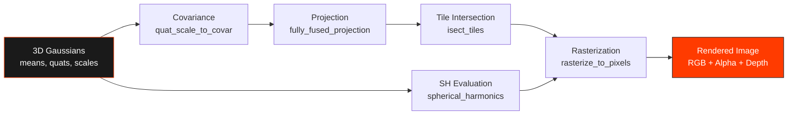
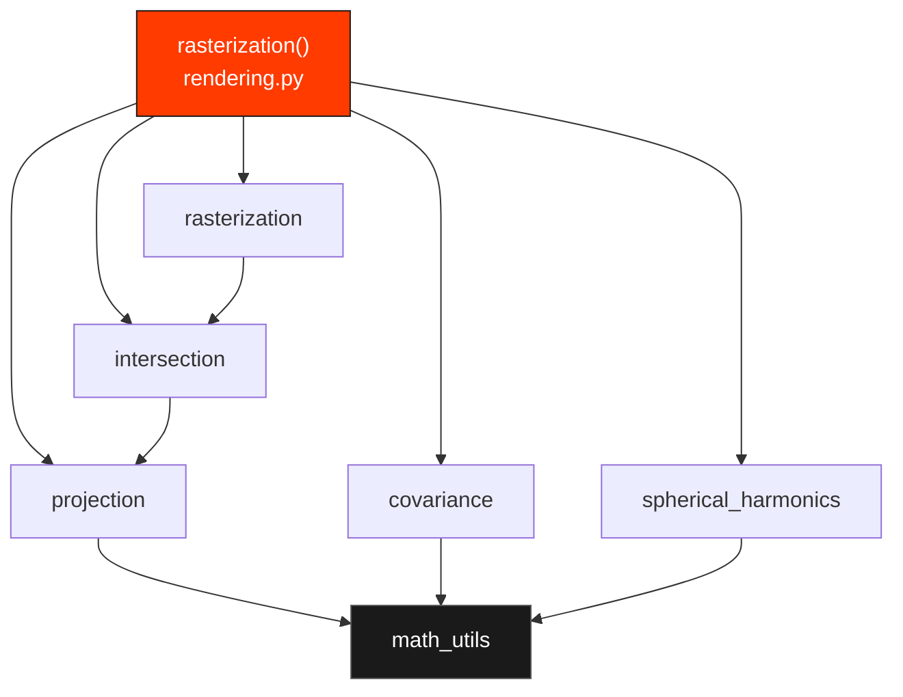
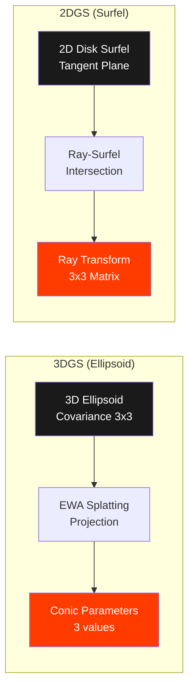

# gsplat-mlx

**3D Gaussian Splatting on Apple Silicon -- Native MLX port of gsplat**

[](https://www.python.org/downloads/)
[](LICENSE)
[](#test-suite)
[](https://github.com/ml-explore/mlx)
[](#requirements)

> Port of [nerfstudio-project/gsplat](https://github.com/nerfstudio-project/gsplat) from CUDA/PyTorch to Apple [MLX](https://github.com/ml-explore/mlx).
> Built by [AIFLOW LABS](https://aiflowlabs.io) / [RobotFlow Labs](https://robotflowlabs.com)

```
 Source     33 files    6,815 lines    100% GPU (Metal) differentiable pipeline
 Tests      25 files    8,799 lines    405 tests passing in 2.8s
 Examples    7 files    1,528 lines    6 standalone demos + CLI trainer
 PRDs       14 files   18,067 lines    Complete porting specification
 Commits    10          3 code reviews  All critical/high issues resolved
```

---

## Why gsplat-mlx?

[gsplat](https://github.com/nerfstudio-project/gsplat) is the backbone of modern 3D Gaussian Splatting research. It powers **SplaTAM**, **MonoGS**, **WildGS-SLAM**, **nerfstudio**, and virtually every 3DGS paper published since 2023. But it is **CUDA-only** -- locking out every Apple Silicon user.

**gsplat-mlx changes that.** It brings the full 3DGS rasterization pipeline natively to Mac M1, M2, M3, and M4 hardware through Apple's MLX framework. No CUDA. No PyTorch at runtime. No emulation layers.

| Problem | Solution |
|---------|----------|
| gsplat requires NVIDIA GPU + CUDA | gsplat-mlx runs natively on Apple Silicon |
| 3DGS research inaccessible on Mac | Full pipeline: projection, SH, rasterization, training |
| No differentiable 3DGS on MLX | Custom backward passes via `@mx.custom_function` + `.vjp` |
| Fragmented Mac ports | API-compatible with upstream gsplat |

---

## Rendering Pipeline



---

## Module Dependency Graph



---

## Quick Start

### Install from source

```bash
git clone https://github.com/RobotFlow-Labs/gsplat-mlx.git
cd gsplat-mlx
uv venv .venv --python 3.12
source .venv/bin/activate
uv pip install -e ".[dev]"
```

### Run the test suite

```bash
pytest tests/ -v
```

---

## Usage

Render 1000 random Gaussians in under 20 lines:

```python
import mlx.core as mx
from gsplat_mlx import rasterization

# Create 1000 random Gaussians
N = 1000
means = mx.random.uniform(-1, 1, (N, 3))
quats = mx.concatenate([mx.ones((N, 1)), mx.zeros((N, 3))], axis=1)
scales = mx.full((N, 3), 0.01)
opacities = mx.ones(N) * 0.8
colors = mx.random.uniform(0, 1, (N, 1, 3))  # SH degree 0

# Camera intrinsics and extrinsics
K = mx.array([[500, 0, 320], [0, 500, 240], [0, 0, 1]], dtype=mx.float32)
viewmat = mx.eye(4)
viewmat = viewmat.at[2, 3].add(3.0)  # camera at z=3

# Render
rendered, alphas, info = rasterization(
    means, quats, scales, opacities, colors,
    viewmat[None], K[None],
    width=640, height=480,
    sh_degree=0,
)

print(f"Output shape: {rendered.shape}")  # [1, 480, 640, 3]
```

---

## Module Architecture

| Module | File | Purpose | Tests |
|--------|------|---------|------:|
| Math Utilities | `core/math_utils.py` | Quaternion algebra, stable norms, polynomial evaluation | 60 |
| Covariance | `core/covariance.py` | Quaternion + scale to 3x3 covariance/precision matrices | 13 |
| Spherical Harmonics | `core/spherical_harmonics.py` | SH evaluation degrees 0--4, view-dependent color | 33 |
| Projection | `core/projection.py` | 3D-to-2D Gaussian projection (pinhole, fisheye, ortho) | 15 |
| Intersection | `core/intersection.py` | Tile-Gaussian intersection, depth sorting, offset encoding | 17 |
| Rasterization | `core/rasterization.py` | Per-pixel alpha compositing with early termination | 11 |
| Accumulate | `core/accumulate.py` | Differentiable compositing (RGB, depth, expected depth) | 27 |
| Rendering API | `rendering.py` | High-level `rasterization()` entry point | 18 |
| Strategy | `strategy/` | Clone / split / prune densification | 26 |
| Optimizers | `optimizers/` | SelectiveAdam with visibility masking | 23 |
| 2DGS | `core_2dgs/` | Surfel-based 2D Gaussian Splatting variant | 10 |
| Losses | `losses.py` | L1 + SSIM loss functions | 23 |
| Utilities | `utils.py` | Depth-to-normal, projection matrices | 13 |
| Smoke Tests | -- | Package imports, MLX environment validation | 14 |
| Training | -- | End-to-end optimization convergence | 9 |
| **Total** | | | **405** |

---

## 3DGS vs 2DGS

gsplat-mlx supports both 3D Gaussian Splatting and 2D Gaussian Splatting (surfel-based):



---

## Build Phases

The project follows a 6-phase build plan with 14 PRDs (Product Requirements Documents):

```mermaid
gantt
    title gsplat-mlx Build Plan
    dateFormat X
    axisFormat %s

    section Phase 1 -- Foundation
    PRD-01 Dev Environment       :done, p01, 0, 1
    PRD-02 Math Utilities        :done, p02, 1, 2

    section Phase 2 -- Core Primitives
    PRD-03 Covariance            :done, p03, 2, 3
    PRD-04 Spherical Harmonics   :done, p04, 2, 3
    PRD-05 Projection            :done, p05, 3, 4

    section Phase 3 -- Rasterization
    PRD-06 Tile Intersection     :done, p06, 4, 5
    PRD-07 Pixel Rasterization   :done, p07, 5, 6
    PRD-08 Accumulate            :done, p08, 4, 5

    section Phase 4 -- High-Level API
    PRD-09 Rendering API         :done, p09, 6, 7
    PRD-10 Densification         :done, p10, 7, 8
    PRD-11 Selective Adam        :done, p11, 7, 8

    section Phase 5 -- End-to-End
    PRD-12 2DGS Support          :done, p12, 8, 9
    PRD-13 Training Loop         :done, p13, 9, 10

    section Phase 6 -- Performance
    PRD-14 Metal Shaders         :active, p14, 10, 12
```



---

## torch-to-mlx Cheat Sheet

Key API mappings used throughout the port:

| PyTorch | MLX | Notes |
|---------|-----|-------|
| `torch.tensor()` | `mx.array()` | |
| `torch.zeros() / ones()` | `mx.zeros() / mx.ones()` | |
| `torch.cat()` | `mx.concatenate()` | |
| `torch.stack()` | `mx.stack()` | |
| `torch.clamp()` | `mx.clip()` | |
| `torch.where()` | `mx.where()` | |
| `torch.einsum()` | `mx.einsum()` | Fully supported |
| `torch.sort()` | `mx.argsort()` + gather | |
| `torch.cumsum()` | `mx.cumsum()` | |
| `tensor.unsqueeze(d)` | `mx.expand_dims(arr, d)` | |
| `tensor.permute()` | `mx.transpose()` | |
| `tensor.contiguous()` | No-op | MLX uses lazy evaluation |
| `tensor.to(device)` | No-op | Unified memory on Apple Silicon |
| `tensor.detach()` | `mx.stop_gradient()` | |
| `torch.autograd.Function` | `@mx.custom_function` + `.vjp` | All backward passes |
| `F.sigmoid()` | `mx.sigmoid()` | |
| `torch.no_grad()` | Not needed | |

---

## Performance

All benchmarks on Apple Silicon with Metal GPU acceleration. The rendering pipeline
(covariance, projection, SH, rasterization) runs entirely on GPU via MLX.
Only tile intersection (integer sorting, non-differentiable) uses CPU.

### Per-Component Timings (Metal GPU)

| Operation | 1K Gaussians | 10K Gaussians | 100K Gaussians |
|-----------|:---:|:---:|:---:|
| Covariance (quat+scale to Sigma) | 1.2ms | 3.4ms | 29.8ms |
| Projection (3D to 2D, 256x256) | 1.2ms | 7.1ms | 62.6ms |
| SH evaluation (degree 0) | 0.2ms | 0.2ms | 0.2ms |

### Full Pipeline (forward pass, differentiable)

| Resolution | Gaussians | Forward | Forward+Backward |
|:---:|:---:|:---:|:---:|
| 64x64 | 500 | 73ms | 273ms |
| 128x128 | 1,000 | 264ms | 788ms |

### Execution Model

```
Forward pass (training):
  Covariance ─── GPU (MLX)
  Projection ─── GPU (MLX)
  SH eval ────── GPU (MLX)
  Intersection ─ CPU (NumPy, non-differentiable)
  Rasterize ──── GPU (MLX, Tier-2 differentiable)
  Loss ───────── GPU (MLX)

Backward pass:
  All gradients computed on GPU via mx.grad()
  Verified end-to-end: image loss → 3D Gaussian means
```

The Tier-2 rasterizer uses Python loops over sorted Gaussians with vectorized
per-tile pixel computation on GPU. A Tier-3 Metal shader implementation (PRD-14)
is planned for 10-100x speedup on the rasterization hot path.

---

## Key Design Decisions

**Pure MLX, no runtime dependencies on CUDA or PyTorch.** The library uses only MLX, NumPy, and SciPy.

**Port the reference implementations, not the raw CUDA kernels.** gsplat ships `_torch_impl.py` files -- pure-Python/PyTorch reference implementations of every kernel. These are tested against the CUDA output and serve as our exact porting blueprint. We translate `torch` calls to `mx` calls, preserving algorithmic correctness.

**`@mx.custom_function` with `.vjp` for all backward passes.** Every differentiable operation (projection, SH evaluation, rasterization, covariance) defines explicit VJP functions, enabling gradient-based optimization of Gaussian parameters.

**Zero NumPy in differentiable paths.** NumPy is used only for I/O and test utilities. All computation in the forward/backward graph is pure MLX to preserve differentiability and GPU acceleration.

**API-compatible with upstream gsplat.** Function signatures mirror the original so that downstream projects (SplaTAM, MonoGS, nerfstudio) can adopt gsplat-mlx with minimal changes.

---

## Requirements

| Requirement | Version |
|-------------|---------|
| macOS | Apple Silicon (M1 / M2 / M3 / M4) |
| Python | >= 3.10 |
| MLX | >= 0.31.0 |
| NumPy | >= 1.24.0 |
| SciPy | >= 1.10.0 |
| Pillow | >= 9.0.0 |

**Dev extras**: pytest, pytest-benchmark, torch (for cross-framework comparison tests), imageio

---

## Test Suite

405 tests covering forward correctness, backward VJP validation, edge cases, and end-to-end training convergence.

```bash
# Run all tests
pytest tests/ -v

# Run a specific module
pytest tests/test_projection.py -v

# Run only tests that do not require torch
pytest tests/ -v -m "not requires_torch"

# Run cross-framework comparison tests
pytest tests/ -v -m "requires_torch"
```

---

## Project Structure

```
gsplat-mlx/
  src/gsplat_mlx/
    __init__.py                 # Public API
    _version.py                 # 0.1.0
    rendering.py                # High-level rasterization() API
    utils.py                    # Depth-to-normal, projection matrices
    losses.py                   # L1 + SSIM losses
    core/
      math_utils.py             # Quaternion algebra, polynomial evaluation
      covariance.py             # Quat + scale -> covariance matrices
      spherical_harmonics.py    # SH evaluation (degrees 0-4)
      projection.py             # 3D->2D Gaussian projection
      intersection.py           # Tile-Gaussian intersection + depth sort
      rasterization.py          # Per-pixel alpha compositing (Tier-1 reference)
      rasterization_mlx.py      # Differentiable GPU rasterizer (Tier-2)
      accumulate.py             # Differentiable compositing
      cameras.py                # Camera models (pinhole, fisheye, ortho)
    core_2dgs/
      projection_2dgs.py        # 2DGS surfel projection
      rasterization_2dgs.py     # 2DGS rasterization
    strategy/
      base.py                   # Abstract densification strategy
      default.py                # Clone / split / prune
      mcmc.py                   # MCMC-based densification
    optimizers/
      selective_adam.py          # Sparse Adam with visibility masking
    compression/
      png_compression.py        # Model compression
      sort.py                   # Morton sort
    exporter.py                 # PLY / .splat export
    color_correct.py            # Affine / quadratic color correction
    relocation.py               # MCMC Gaussian relocation
    scenes.py                   # Synthetic scene generators
  tests/                        # 405 tests
  prds/                         # 14 Product Requirements Documents
```

---

## Contributing

Contributions are welcome. The project uses `uv` for package management and `pytest` for testing.

```bash
# Setup development environment
uv venv .venv --python 3.12
source .venv/bin/activate
uv pip install -e ".[dev]"

# Run tests before submitting
pytest tests/ -v
```

When adding new functionality:
- Follow the `@mx.custom_function` + `.vjp` pattern for differentiable operations
- Add tests that validate both forward correctness and backward gradients
- Keep function signatures compatible with upstream gsplat where possible
- Use `mx.where()` instead of boolean indexing (MLX limitation)
- Alias `mlx.core` as `mx` throughout

---

## License

[Apache-2.0](LICENSE)

---

## Credits

**Upstream**: [nerfstudio-project/gsplat](https://github.com/nerfstudio-project/gsplat) -- the CUDA 3D Gaussian Splatting library this project ports to MLX.

**Built by**: [AIFLOW LABS](https://aiflowlabs.io) / [RobotFlow Labs](https://robotflowlabs.com)

**Prior art**: [pointelligence-mlx](https://github.com/RobotFlow-Labs/pointelligence-mlx) -- our earlier port of PointCNN++ (CVPR 2026) from PyTorch+CUDA to MLX, which established the `@mx.custom_function` porting patterns reused here.
